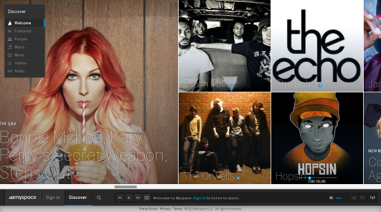
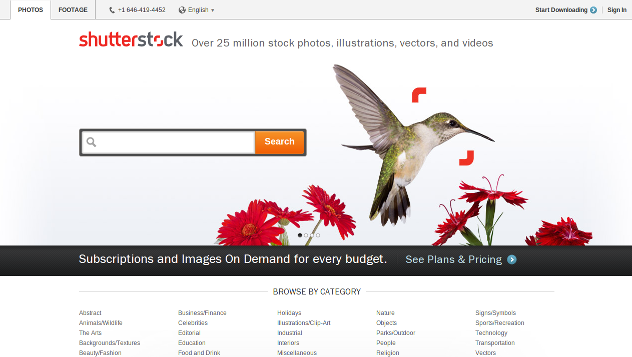
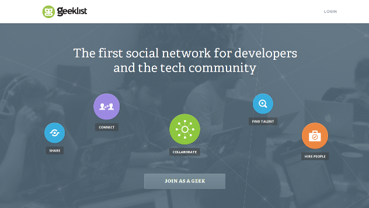
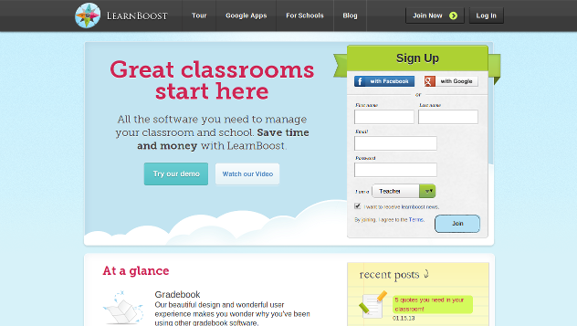

# Node.js In Action

Supaya anda lebih tertarik dalam belajar Node.js berikut beberapa website terkenal yang sudah memakai Node.js

www.myspace.com

www.yummly.com

www.shutterstock.com

www.klout.com

www.geekli.st

www.learnboost.com

Apakah masih ragu untuk memakai Node.js ?...Kalau masih penasaran apa yang membuat Node.js berbeda dari backend pada umumnya, silahkan dilanjutkan membaca :smile:

