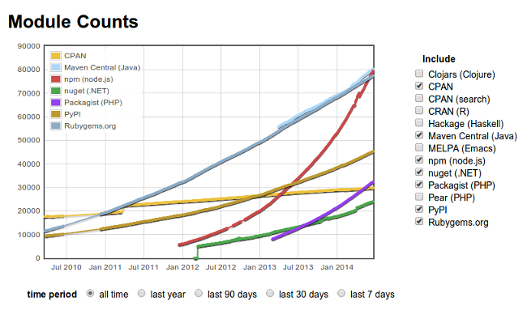

# Module npm

`nice people matter`

npm merupakan package manager untuk Node.js dan untuk nama `npm` bukanlah suatu singkatan. Hanya dalam waktu 2 tahun sejak di releasenya Node.js ke publik jumlah modul melesat jauh bahkan hampir menyamai modul java ataupun ruby gems.

Grafik diatas didapat dari [http://modulecounts.com](http://modulecounts.com).

Banyaknya push module ke repositori npm dapat diartikan adanya kepercayaan publik terhadap platform ini dan untuk kedepannya Node.js akan menjadi platform yang prospektif untuk berinvestasi.

