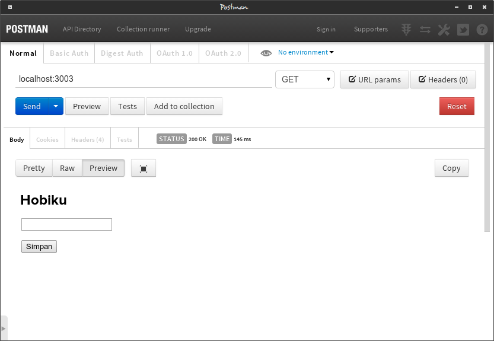
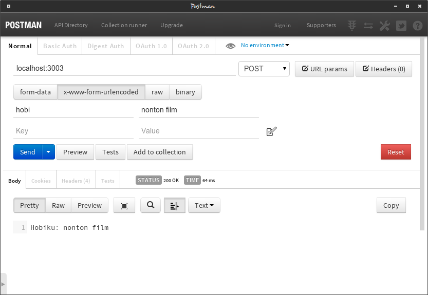

# URL Encode

Hanya akan dibahas untuk 2 metode HTTP yaitu `GET` dan `POST` saja. Metode `GET` untuk menampilkan form html dan `POST` untuk menangani data form yang dikirim

Ok langsung kita lihat kode server sederhana untuk parsing data form melalui objek `request` dengan data form bertipe `application/x-www-form-urlencoded` yang merupakan default dari tag form.

```text
var http = require('http');
var data = [];
var qs = require('querystring');

var server = http.createServer(function(req, res){
    if('/' == req.url){
        switch(req.method){
            case 'GET':
                tampilkanForm(res);
                break;
            case 'POST':
                prosesData(req, res);
                break;
            default:
                badRequest(res);
        }
    } else {
        notFound(res);
    }
});

function tampilkanForm(res){
    var html = '<html><head><title>Data Hobiku</title></head><body>'
        + '<h1>Hobiku</h1>'
        + '<form method="post" action="/">'
        + '<p><input type="text" name="hobi"></p>'
        + '<p><input type="submit" value="Simpan"></p>'
        + '</form></body></html>';

    res.setHeader('Content-Type', 'text/html');
    res.setHeader('Content-Length', Buffer.byteLength(html));
    res.end(html);
}

function prosesData(req, res) {
   var body= '';
   req.setEncoding('utf-8');
   req.on('data', function(chunk){
       body += chunk;
   });

   req.on('end', function(){
       var data = qs.parse(body);
       res.setHeader('Content-Type', 'text/plain');
       res.end('Hobiku: '+data.hobi);
   });
}

function badRequest(res){
   res.statusCode = 400;
   res.setHeader('Content-Type', 'text/plain');
   res.end('400 - Bad Request');
}

function notFound(res) {
   res.statusCode = 404;
   res.setHeader('Content-Type', 'text/plain');
   res.end('404 - Not Found');
}

server.listen(3003);
console.log('server http berjalan pada port 3003');
```

Untuk mengetest `GET` dan `POST` bisa dilakukan melalui curl, browser atau melalui gui [Postman](http://www.getpostman.com/).

## GET



## POST



module `querystring` dari Node.js berfungsi untuk mengubah url encoded string menjadi objek JavaScript. Contohnya

```text
querystring.parse('nama=lanadelrey&job=singer&album=borntodie&ultraviolence');
// returns
{ nama: 'lanadelrey', job: 'singer',album: ['borntodie', 'ultraviolence']}
```

