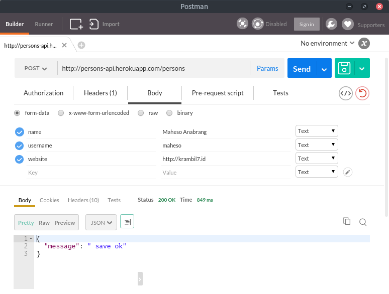
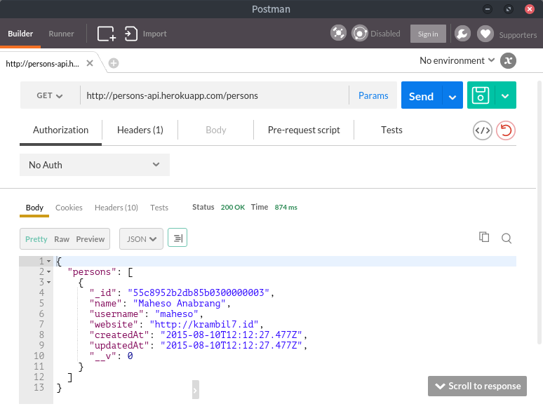
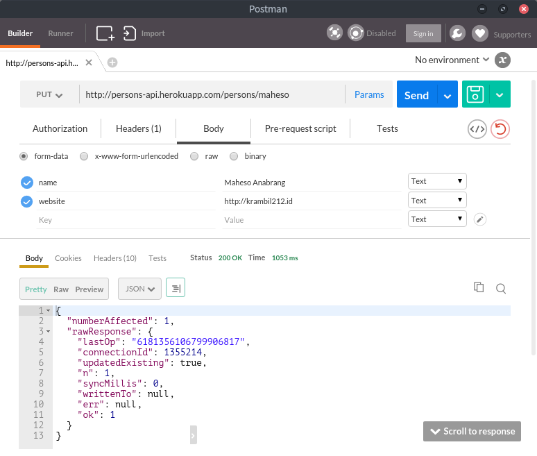
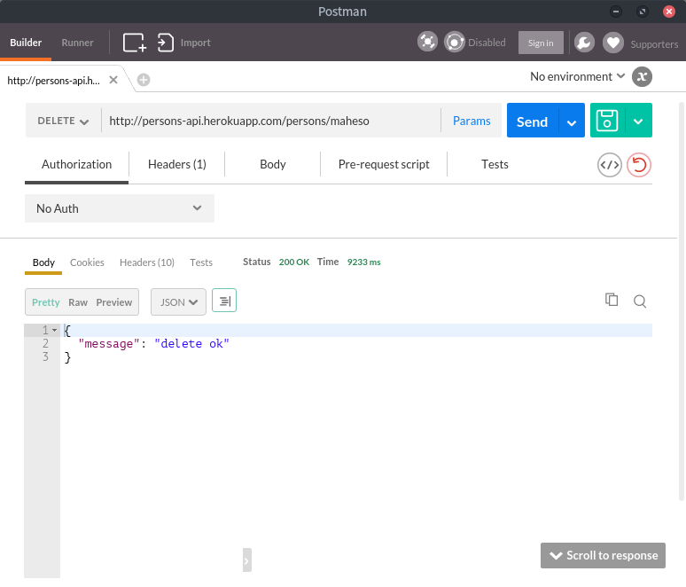

# Pengetesan

Untuk menggunakan atau pengetesan API ini cara termudah adalah dengan memakai [Postman](https://www.getpostman.com/) atau jika anda sudah terbiasa memakai tool terminal seperti [cURL](http://curl.haxx.se/) atau [Httpie](https://github.com/jkbrzt/httpie) silahkan saja.

Demo aplikasi berada pada link berikut,

> [persons-api.herokuapp.com](https://github.com/junwatu/pengenalan-nodejs-gitbook/tree/6e76b1c428229f82ce33f1967c256f2a5db3502d/person_rest_api/persons-api.herokuapp.com)

## POST /persons

Untuk membuat data Person baru melalui api `/persons` cukup dengan memakai request POST.

## GET /persons

Mengambil data dengan mengakses API `/persons` yang akan mengembalikan semua data yang telah tersimpan sebelumnya.

## PUT /persons/:username

Update data bisa dilakukan dengan mudah dengan memakai PUT.

## DELETE /persons/:username

Operasi penghapusan data hanya bisa dilakukan satu persatu melalui key `:username`.

